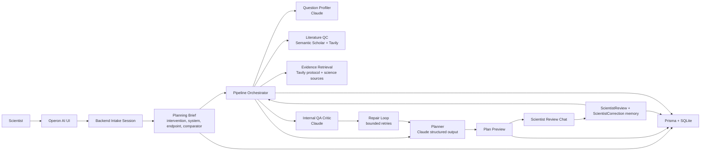
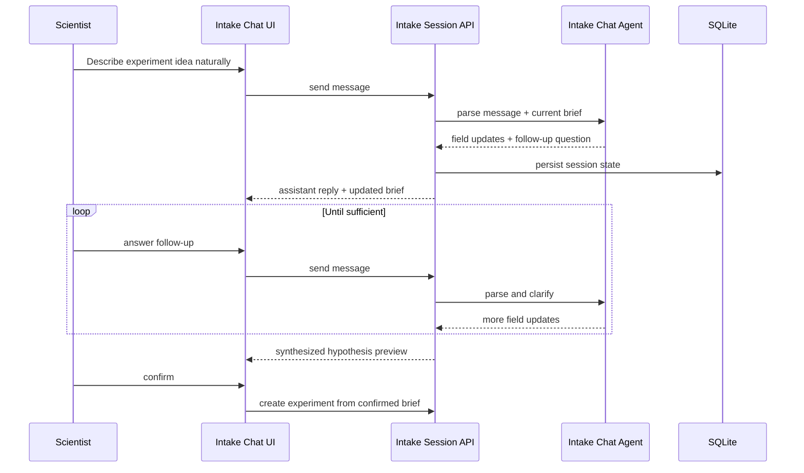
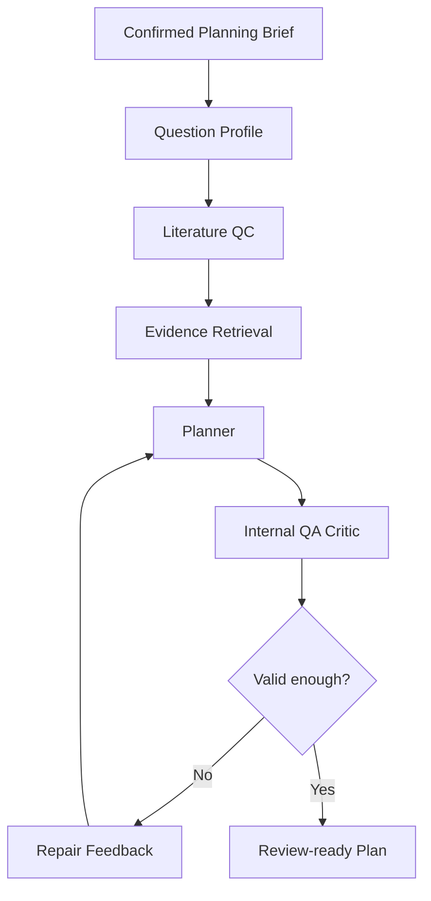
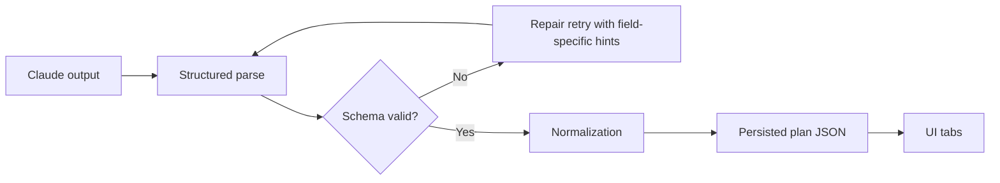
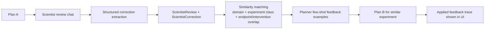
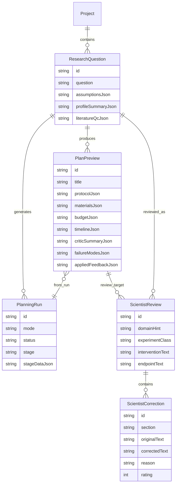

<!-- Created: 2026-04-26 -->

# Operon AI Technical Showcase

> Audience: hackathon technical review
> Format: Prezi + screen recording
> Recommended length: 3.5 to 5 minutes
> Goal: show that Operon AI is a controlled, grounded scientific planning system rather than a generic text generator

---

## 1. Technical Review Storyline

Use the Prezi flow in this exact order:

1. **What Operon AI does**
2. **System architecture**
3. **Conversational intake and planning brief**
4. **Grounded planning pipeline**
5. **Structured outputs and hidden QA**
6. **Persistent scientist feedback loop**
7. **Data model and persistence**
8. **Current limitations and scaling path**

The story to tell is:

**Operon AI is a controlled planning system.**
It does not take arbitrary text and dump arbitrary text back out.
It first gathers sufficient experiment inputs, converts them into a typed planning brief, grounds generation with live retrieval, validates outputs against schemas, runs internal QA and repair, and now learns from structured scientist corrections across similar experiments.

---

## 2. Prezi Frame Outline

### Frame 1 — What Operon AI Is

**On screen**
- Product name: `Operon AI`
- One line:
  `A scientific planning copilot that turns a research idea into a grounded, lab-executable experiment plan.`
- Tech stack:
  `Next.js 16 · TypeScript · Anthropic Claude · Tavily · Semantic Scholar · Prisma · SQLite`

**What to say**
Operon AI is not a chatbot that writes vague protocols.
It is a staged scientific planning system that converts a research idea into a structured plan with protocol steps, materials, budget, timeline, validation, literature QC, and now a persistent expert-feedback memory loop.

---

### Frame 2 — System Architecture

**Diagram**

**What to say**
The architecture has four control layers.
First, backend intake creates a canonical planning brief.
Second, the pipeline grounds planning with literature and protocol retrieval.
Third, the planner produces typed output and passes through hidden QA and repair before the user sees it.
Fourth, scientist corrections are stored as structured memory and reused automatically for future similar runs.

---

### Frame 3 — Conversational Intake

**Diagram**

**What to say**
This is no longer a fake wizard.
The backend owns the conversation.
It keeps asking until Operon AI has the minimum required planning inputs:
intervention, model system, primary endpoint, and comparator.
That becomes the typed planning brief, which is the real handoff into planning.

**Important line**
We intentionally removed pseudo-scientific hypothesis blocking.
Before planning, Operon AI checks intake sufficiency, not scientific truth.

---

### Frame 4 — Grounded Planning Pipeline

**Diagram**

**What to say**
The user-facing flow stays simple, but behind it the system is controlled.
The planner never gets to produce unreviewed output directly to the screen.
It passes through internal QA first.
If the QA agent finds missing controls, weak validation alignment, incoherent budget math, or source realism issues, the planner is revised before the plan is shown.

---

### Frame 5 — Structured Outputs and Validation

**On screen**
- `Zod schemas`
- `Anthropic structured parsing`
- `Deterministic normalization`
- `Persisted stage data`

**Diagram**

**What to say**
This is the core engineering claim:
Operon AI does not trust raw LLM text.
Planner, profiler, critic, intake, and review extraction all use typed schemas.
The system validates shape, required fields, and selected constraints, then normalizes the result before persistence.

**Call out specifically**
- planning brief schema
- question profile schema
- literature QC schema
- experiment plan schema
- critic summary schema
- review correction schema

---

### Frame 6 — Persistent Scientist Feedback Loop

**Diagram**

**What to say**
This is the stretch-goal story.
Operon AI is not fine-tuning the base model.
Instead, it stores expert corrections as structured memory and automatically injects the most relevant ones into future similar runs.
That makes the effect visible, auditable, and immediate.

**Demo line**
A judge can watch Plan A get corrected, then see Plan B for a similar experiment visibly incorporate that prior expert feedback without being manually re-prompted.

---

### Frame 7 — Data Model

**Diagram**

**What to say**
The persistence layer is deliberately simple for the MVP.
Everything is traceable through Prisma and SQLite:
the intake artifact, pipeline stages, draft preview, critic result, and now structured scientist corrections with enough metadata to support future reuse.

---

### Frame 8 — Reliability, Candor, and Scaling

**On screen**
- `What is strong now`
- `What is intentionally simple`
- `What scales next`

**What to say**
What is strong now:
- controlled typed outputs
- grounded retrieval before planning
- hidden QA before display
- persistent expert feedback memory

What is intentionally simple:
- SQLite for speed
- novelty QC is still heuristic rather than full semantic similarity
- feedback reuse is few-shot memory injection, not true fine-tuning

What scales next:
- stronger novelty scoring
- bounded hybrid agent planner
- deeper supplier verification
- more robust similarity matching for expert corrections

---

## 3. Video Capture Plan

Use this order when recording UI footage for the Prezi:

1. **Dashboard**
   - show multiple experiments
   - point to novelty, score, status, and recent runs

2. **Conversational intake**
   - show Operon AI asking follow-up questions
   - show that the backend keeps guiding until comparator and endpoint are captured

3. **Pipeline page**
   - highlight the stages:
     - intake confirmed
     - literature QC
     - plan generation
     - internal QA
     - ready

4. **Full plan page**
   - protocol tab
   - materials tab
   - budget tab
   - timeline tab
   - validation tab

5. **Review chat bubble**
   - open it from the full plan page
   - submit one scientist correction in natural language
   - show extracted correction ready for confirmation

6. **Future similar plan**
   - show the applied prior corrections banner
   - point to the correction trace

---

## 4. Suggested Narration Script

### Opening
Operon AI is a scientific planning copilot. It turns a research idea into a grounded, lab-executable experiment plan, but does so through a controlled architecture rather than raw text generation.

### Intake
The first control layer is intake. Instead of letting the user submit one vague blob, the backend runs a real conversation to gather the minimum planning inputs: intervention, system, endpoint, and comparator. That becomes a typed planning brief.

### Pipeline
Once intake is confirmed, Operon AI profiles the experiment, runs literature QC, retrieves protocol and scientific sources, and generates a structured plan. The plan does not go straight to the UI. It passes through an internal QA and repair loop first.

### Validation
Every major step is schema-validated. The system parses structured outputs, normalizes them, persists them, and only then renders them into protocol, materials, budget, timeline, validation, and source views.

### Feedback loop
The newest layer is persistent expert feedback. A scientist can now correct a plan in natural language through a review chat. Operon AI extracts structured corrections, saves them in the database, and automatically reuses the most relevant corrections in future similar plans.

### Close
So the technical claim is not just that we used AI. The claim is that we wrapped AI in a scientific control plane: sufficient intake, grounded generation, hidden QA, and expert feedback memory.

---

## 5. Judge-Facing Technical Claims

These are safe, accurate statements for the video:

- Operon AI uses **backend-managed conversational intake** to build a typed planning brief before planning starts.
- The planning pipeline is **grounded with live retrieval** from Tavily and Semantic Scholar before draft generation.
- Major model outputs are **schema-validated and normalized** before persistence and display.
- Plans pass through a **hidden internal QA and repair loop** before becoming review-ready.
- Scientist feedback is stored as **structured correction memory** and automatically reused for future similar experiments.

Avoid saying these unless they become true:

- “The model is fine-tuned on scientist feedback.”
- “Novelty is determined by full semantic understanding of the literature.”
- “Operon AI proves a hypothesis is scientifically true.”

---

## 6. Honest Technical Tradeoffs

If asked about limitations, say:

- Novelty QC is currently a practical heuristic over retrieved evidence, not a full scientific novelty engine.
- Feedback reuse is structured memory injection, not model training.
- SQLite is used for speed and hackathon delivery, not long-term scale.
- Operon AI optimizes for planning quality and traceability, not autonomous experimental execution.

---

## 7. Optional Final Frame

**Title**
`Why this architecture matters`

**One sentence**
Operon AI is valuable because it treats scientific planning as a controlled system design problem, not just a prompting problem.
